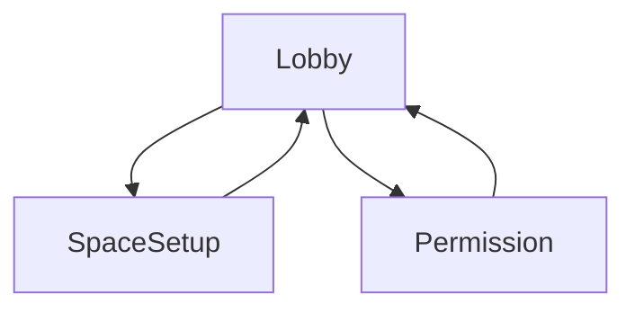
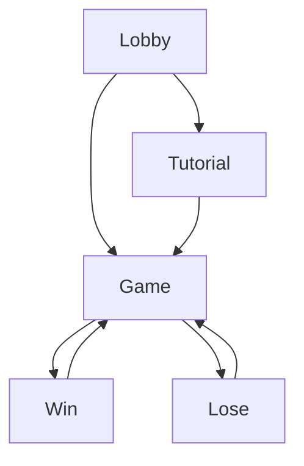

# Project Phanto - Presence Platform Reference App


# Project Overview

Project Phanto is an Unreal reference app demonstrating the latest Presence Platform features, including scene mesh, Scene Model, and Scene API objects. It uses [the Meta fork of Unreal Engine 5.6](#meta-fork).

The [scene mesh](https://developers.meta.com/horizon/documentation/unreal/unreal-scene-mesh/) is a low-fidelity, high-coverage artifact that defines the boundary between free and occupied space in a room. It is generated automatically during the Space Setup experience and can be queried by applications via the Scene API.

The haptic assets used in this project have been designed with [Haptics Studio](https://developer.oculus.com/documentation/unity/haptics-studio/), and were integrated using the [Haptics SDK for Unreal](https://developer.oculus.com/documentation/unreal/unreal-haptics-sdk) following our [Haptic Design Guidelines](https://developer.oculus.com/resources/haptics-design-guidelines/).

## Build Instructions

### Download the Project

First, install Git LFS by running:

```sh
git lfs install
```

Then clone this repository using the "Code" button above or this command:

```sh
git clone https://github.com/oculus-samples/Unreal-Phanto
```

### Launch the Project in Unreal Editor

Choose one of the following options:

<details>
  <summary><b>Epic Games Launcher with MetaXR Plugin</b></summary>

<p>

The easiest way to start is using the prebuilt Unreal Engine from the Epic Games Launcher with the MetaXR plugin.

1. Install the [Epic Games Launcher](https://store.epicgames.com/en-US/download).
2. Install UE5 (recommended) via the launcher.
3. Download and install the MetaXR v81 plugin from the [Unreal Engine 5 Integration download page](https://developers.meta.com/horizon/downloads/package/unreal-engine-5-integration/81.0).
4. Launch the Unreal Editor.
5. From "Recent Projects," click "Browse" and select `Phanto.uproject`.

</p>
</details>

<a id="meta-fork"></a>
<details>
  <summary><b>Meta Fork of Epic’s Unreal Engine</b></summary>

<p>

The Meta fork provides the latest Oculus features but requires building the editor from source.

1. Follow [Accessing Unreal Engine source code on GitHub](https://www.unrealengine.com/en-US/ue-on-github) to get:
    - an Epic account
    - a GitHub account
    - authorization to access the Unreal Engine source repository

    Ignore instructions for downloading Epic’s Unreal Engine source code; you will build the Meta fork instead.
2. Ensure Visual Studio is installed with the "Game development with C++" workload.
3. Download the source from the [Meta fork of Epic’s Unreal Engine on GitHub](https://github.com/Oculus-VR/UnrealEngine/tree/oculus-5.6).
4. Follow Epic’s [Building Unreal Engine from Source](https://dev.epicgames.com/documentation/en-us/unreal-engine/building-unreal-engine-from-source?application_version=5.3) instructions. The build may take some time.
5. In the Unreal repository root, run:

    ```sh
    .\GenerateProjectFiles.bat -Game Phanto -Engine <full path to Unreal-Phanto directory>\Phanto.uproject
    ```

</p>
</details>

### Running the Project

You can run the project using one of these methods:

<details>
  <summary><b>Running on a Quest 3</b></summary>

<p>

Build, deploy, and run the game directly on your headset.
</p>
</details>

<details>
  <summary><b>Running with Quest Link</b></summary>

<p>

1. Open the Meta Quest Link app.
2. Enable Meta Quest Link from the headset.
3. Run the game in Unreal using the **VR Preview** button.

**Note:** Scene mesh and room elements appear in Link, but you can only trigger room scanning inside the headset. Please scan beforehand.
</p>
</details>

<details>
  <summary><b>Running with XR Simulator</b></summary>

<p>

1. Enable [XR Simulator](https://developers.meta.com/horizon/documentation/unreal/xrsim-intro/) and press **Play**.
2. Run the game in Unreal using the **VR Preview** button.

</p>
</details>

## License

This codebase serves as a reference and template for mixed reality projects. The [Oculus SDK License](./LICENSE) applies to the SDK and supporting materials. The MIT License applies only to clearly marked documents. If a file lacks a license indication, the Oculus License applies.

## Contribution

See the [CONTRIBUTING](./CONTRIBUTING.md) file for contribution guidelines.

## Using the Project's Scenes

The project includes three main scenes and nine example scenes:

1. [LobbyScene.umap](./Content/Phanto/Maps/LobbyScene.umap): An introduction scene showing the current mesh and allowing the player to start the game.
2. [TutorialScene.umap](./Content/Phanto/Maps/TutorialScene.umap): A tutorial presenting controls and game dynamics.
3. [GameScene.umap](./Content/Phanto/Maps/GameScene.umap): Contains assets for gameplay, including Phanto, the Phantoms, and other elements.

# Health and Safety Guidelines

Evaluate your mixed reality content for health and safety to ensure a comfortable user experience. Read the [Mixed Reality H&S Guidelines](https://developers.meta.com/horizon/design/mr-health-safety-guideline/) before designing or developing your app with this sample or any Presence Platform features.

Avoid improper occlusion, which happens when virtual content ignores the physical environment. This can cause users to misjudge actionable space.

- See [Occlusions with Virtual Content](https://developers.meta.com/horizon/design/mr-health-passthrough).
- To prevent improper occlusion, ensure users have (1) completed Space Setup and (2) granted Spatial Data permission. This enables proper occlusion in content placement, mesh collisions, and air navigation.

Using semi-transparent content improves users' view of their physical space and reduces occlusion of uncaptured objects or people.

- Spatial data excludes dynamic elements like moved furniture or moving people/pets.
- Uncaptured dynamic elements may be occluded by virtual content, increasing safety risks during mixed reality experiences.

# Design Flow

The diagrams below show the game's main user flow.

## Setup Design

Before starting, the setup flow verifies that the user has:

- Completed **Space Setup** and has a Scene Model.
- Granted **Spatial Data** permission ([implementation instructions](https://developers.meta.com/horizon/documentation/unreal/unreal-spatial-data-perm/)).

Without these, the app cannot function. Users can only proceed after meeting these requirements.



If permission is denied or no Scene Model exists, prompts will be presented to allow rescanning the room and granting permissions.

|                      Missing Scene Prompt                       |                           Permission Prompt                           |
| :-------------------------------------------------------------: | :-------------------------------------------------------------------: |
|  |  |

## Gameplay Design

After meeting setup requirements, the player follows this flow. The tutorial runs on first launch but can be skipped afterward.



# Device Compatibility

| Device    | Scene API | Color Passthrough | High Res color | Scene Mesh | Haptics<sup>[1](#HapticsQuality)</sup> |
| :-------- | :-------: | :---------------: | :------------: | :--------: | :--------: |
| Quest 3   |    ✔️     |        ✔️         |       ✔️       |     ✔️     |     ✔️     |
| Quest Pro |    ✔️     |        ✔️         |       ❌       |     ❌     |     ✔️     |
| Quest 2   |    ✔️     |        ❌         |       ❌       |     ❌     |     ✔️     |

<a name="HapticsQuality">1</a>: There have been significant improvements in the
haptics capability of Quest Pro and Quest 3 controllers over Quest 2: Quest Pro
and Quest 3 introduce TruTouch haptics, enabling a new level of immersion in
your applications. For more information, visit our
[Haptic Design Guidelines](https://developer.oculus.com/resources/haptics-design-guidelines/#meta-quest-platform-and-haptic-hardware-considerations).

# Key Components

The game demonstrates best practices using the new scene mesh feature and updated Scene API.

## The Scene Mesh

The project accesses the scene mesh via **PhantoSceneActor**. Each map creates a **PhantoSceneActor** that loads the mesh and room elements captured during space setup. The mesh appears as a standard Unreal StaticMeshComponent and responds to ray casts.

For more details, visit the [Meta Quest Developer Portal](https://developers.meta.com/horizon/documentation/unreal/scene-best-practices/).

## The Ectofluid (Ghostly Goo)

Ectofluid is a ghostly goo created by Phanto and the Phantoms. If your room gets too covered, you lose the game.

This element shows how virtual content can attach to the physical environment via the scene mesh, adjusting to the real space.

## The Polterblast 3000


This demonstrates using the scene mesh as a physics component. The fluid collides with the mesh, creating splashes. Use fast-collision particles for a more immersive effect.

- Use the Polterblast 3000 to throw Ectofluid and clean ghostly goo.
- Press the Right Trigger to throw Ectofluid.

## Phanto and the Phantoms


Beware! Phantoms appear in your room. Use the Polterblast 3000 (RT) and Ecto Blaster (LT) to defeat them.

- Phanto is an air-navigated NPC using the scene mesh as a sensor to find navigation and spawn points for Ectofluid.
- Phantoms are ground-navigated NPCs using the scene mesh and room capture data (furniture, windows, etc.) to navigate, jump, and spawn Ectofluid.

## Ecto Blaster


The Ecto Blaster defeats Phantoms. Point to a location and press the Left Trigger to place it. This shows how to trace and ray cast against the environment using the scene mesh as a ray cast layer, enabling virtual content placement that responds to the scene.

# Main Scenes

## LobbyScene

This introductory scene lets players view, scan, and modify their scene. If no scene data exists, players enter the **Space Setup** flow. If scene data exists, players can:

1. Start the [TutorialScene](#tutorialscene).
2. Start the [GameScene](#gamescene).
3. Restart **Space Setup** by pressing the left trigger to rescan the environment.

|                      Rescan Scene                      |                     Start Game                     |
| :----------------------------------------------------: | :------------------------------------------------: |
|  |  |

## TutorialScene

The tutorial teaches players to:

- Use the Polterblast 3000.
- Place the Ecto Blaster.
- Shoot and interact with Phantoms.

The tutorial is mandatory on first run. Afterwards, players can repeat it or skip to the game.

This scene includes examples of subcomponents (excluding Phanto) and controller-locked UI screens.

|                     Welcome                     |                   Polterblast                   |                  Ecto Blaster                   |                    Phantoms                     |                   Start Game                    |
| :---------------------------------------------: | :---------------------------------------------: | :---------------------------------------------: | :---------------------------------------------: | :---------------------------------------------: |
|  |  |  |  |  |

## GameScene


This scene contains prefabs for:

- Phanto
- Phantoms
- Polterblast 3000
- Ecto Blaster

You can run this scene standalone, via Meta Quest Link, or by building and deploying to your device.

Restarting the game is as simple as reloading the scene. Debug features can be enabled with the **Menu** button on the left controller.

The scene includes the **PhantoSceneActor** component, which loads the mesh and scene data. Other components manage sound, GUI alerts, runtime assets, and game events.

|                          Object Placement                           |                                AI Navigation                                 |
| :-----------------------------------------------------------------: | :--------------------------------------------------------------------------: |
|  |  |

## HapticsScene

Showcases the integration of haptics with dynamic modulation tied to controller interactions: Pressing the index or grab button will trigger a synchronized audio-haptic effect. Moving the thumbstick up or down will modulate the amplitude of the effect, while moving it left or right will modulate the frequency.

The haptic assets used in this project have been designed with [Haptics Studio](https://developer.oculus.com/documentation/unity/haptics-studio/), and were integrated using the [Haptics SDK for Unreal](https://developer.oculus.com/documentation/unreal/unreal-haptics-sdk) following our [Haptic Design Guidelines](https://developer.oculus.com/resources/haptics-design-guidelines/).

To learn more about the Haptics SDK for Unreal, and how dynamically modulated haptics were implemented, check out the [BP_VRExamplePawn](https://github.com/oculus-samples/Unreal-Phanto/blob/main/Plugins/MetaXRHaptics/Content/Example/Blueprints/BP_VRExamplePawn.uasset) blueprint in the Haptics Scene, or the `Play random sound and haptic` function in the [BP_Phanto](https://github.com/oculus-samples/Unreal-Phanto/blob/main/Content/Phanto/Enemies/Phanto/BP_Phanto.uasset) blueprint for the Phanto haptics featured in the main game loop!

# Features Illustrated

## Content Placement


The [BP_EctoBlasterSpawner](./Content/Phanto/EctoBlaster/BP_EctoBlasterSpawner.uasset) blueprint shows how to use the global mesh to place objects on room surfaces.

## Mesh Collisions


The [EctoStream](./Content/Phanto/EctoFluid/EctoStream.uasset) particle system uses the global mesh for physics. Fast collisions cause Ectofluid to splash off the mesh by bouncing particles off the surface using Niagara's Collision module.

## Air Navigation


[BP_Phanto](./Content/Phanto/Enemies/Phanto/BP_Phanto.uasset) uses the scanned mesh as a sensor for air navigation. See the `OnSphereOverlap` function for details.

## Mesh Navigation


The [GameScene](./Content/Phanto/Maps/GameScene.umap) Level Blueprint uses the mesh for ground navigation, with optional bounding boxes for furniture captured manually. You can view the NavMesh by running the console command `show Navigation` via the `~` terminal or [adb](https://developers.meta.com/horizon/blog/developer-perspective-ue4-logging-and-console-commands-for-mobile-vr/) on a device.

The NavMesh is dynamically generated using settings in [DefaultEngine.ini](./Config/DefaultEngine.ini) under `[/Script/NavigationSystem.RecastNavMesh]` and `[/Script/NavigationSystem.NavigationSystemV1]`.

Note: `bInitialBuildingLocked=True` delays NavMesh creation until scene anchors spawn, triggered by `ReleaseInitialBuildingLock()`.

After generation, GameScene calls `SetNavigationRuntimeGenerationMode(Static)` and `ConfigureNavigationSystemAsStatic(true)`.

All functions are in [PhantoBlueprintFunctionLibrary.h](./Source/Phanto/Public/PhantoBlueprintFunctionLibrary.h).

## Scene Visualization


The [LobbyScene](./Content/Phanto/Maps/LobbyScene.umap) displays the mesh and furniture bounding boxes if available.
