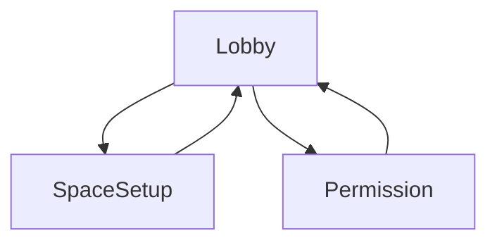
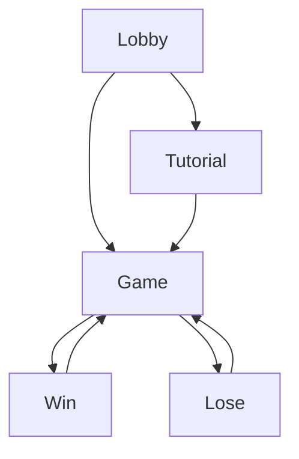

# Project Phanto - Presence Platform Reference App


# Project overview

Project Phanto is an Unreal reference app, showcasing the latest Presence Platform
features, highlighting scene mesh, Scene Model, and Scene API objects. It was developed using [the Meta fork of Unreal Engine 5.3](#meta-fork).

The
[scene mesh](https://developer.oculus.com/documentation/unreal/unreal-scene-mesh/)
is a low-fidelity, high-coverage artifact which describes the boundary between
free and occupied space in a room. It is generated automatically during the
Space Setup experience, and available for applications to query via Scene API.

The haptic assets used in this project have been designed with [Haptics Studio](https://developer.oculus.com/documentation/unity/haptics-studio/), and were integrated using the [Haptics SDK for Unreal](https://developer.oculus.com/documentation/unreal/unreal-haptics-sdk) following our [Haptic Design Guidelines](https://developer.oculus.com/resources/haptics-design-guidelines/).

## License

This codebase is available as both a reference and a template for mixed reality
projects. The [Oculus SDK License](./LICENSE) applies to the SDK and supporting
material. The MIT License applies to only certain, clearly marked documents. If
an individual file does not indicate which license it is subject to, then the
Oculus License applies.

See the [CONTRIBUTING](./CONTRIBUTING.md) file for how to help out.

## How to Use

### Download the project

First, ensure you have Git LFS installed by running this command:

```sh
git lfs install
```

Then, clone this repo using the "Code" button above, or this command:

```sh
git clone https://github.com/oculus-samples/Unreal-Phanto
```

### Launch the project in the Unreal Editor using one of the following options

<details>
  <summary><b>Epic Games Launcher with MetaXR plugin</b></summary>

<p>

The easiest way to get started is to use the prebuilt Unreal Engine from the Epic Games Launcher, with MetaXR plugin.

1. Install the [Epic Games Launcher](https://www.epicgames.com/store/en-US/download)
2. In the launcher, install UE5 (recommended).
3. Download and install the MetaXR plugin from the [Unreal Engine 5 Integration download page](https://developer.oculus.com/downloads/package/unreal-engine-5-integration).
4. Launch the Unreal Editor
5. From "Recent Projects", click "Browse" and select `Phanto.uproject`

</p>
</details>
<a id="meta-fork"></a>
<details>
  <summary><b>Meta fork of Epic’s Unreal Engine</b></summary>

<p>

The Meta fork of Epic’s Unreal Engine will give you the most up to date integration of Oculus features. However, you must build the editor from its source.

1. Follow the instructions on [Accessing Unreal Engine source code on GitHub](https://www.unrealengine.com/en-US/ue-on-github) to obtain:
    - an Epic account
    - a GitHub account
    - authorization to access the Unreal Engine source repository

    Disregard instructions on downloading Epic’s Unreal Engine source code as you will be building the Meta fork of Epic’s Unreal Engine source.
1. Make sure you have Visual Studio installed properly:
    - Launch the Visual Studio Installer and click Modify for the Visual Studio version you want to use.
    - Under the Workloads tab, click Game development with C++ if it isn’t checked and then click Modify.
1. Download the source code from the [Meta fork of Epic’s Unreal Engine on GitHub](https://github.com/Oculus-VR/UnrealEngine).
1. Follow Epic’s instructions on [Building Unreal Engine from Source](https://docs.unrealengine.com/5.3/en-US/building-unreal-engine-from-source/) to complete the process.
    Depending on your machine, the build may take awhile to complete.
1. Open a command prompt in the root of the Unreal repo, then run this command:
    ```sh
    .\GenerateProjectFiles.bat -Game Phanto -Engine <full path to Unreal-Phanto directory>\Phanto.uproject
    ```
</p>
</details>

### Running the project

There are three options for running the project.

<details>
  <summary><b>Running on a Quest 3</b></summary>

<p>

Build, deploy, and run the game on your headset.
</p>
</details>
<details>
  <summary><b>Running with Quest Link</b></summary>

<p>

1. Open the Oculus app.
1. Run Oculus Link from the headset.
1. Run the game in Unreal using the **VR Preview** button.

**\*NOTE**: Scene mesh and room elements will show up in Link. However, you can
only trigger room scan from within the headset. Please do it beforehand.\*
</p>
</details>
<details>
  <summary><b>Running with XR Simulator</b></summary>

<p>

1. Enable
[XR Simulator](https://developer.oculus.com/documentation/unreal/xrsim-intro/),
and press **Play**.
1. Run the game in Unreal using the **VR Preview** button.

</p>
</details>

## Using the project's scenes

After opening the project, you will find three main scenes and nine example
scenes:

1. [LobbyScene.umap](./Content/Phanto/Maps/LobbyScene.umap): this
   self-contained scene contains the introduction scene, showing the current
   mesh, and allows the player to start the game.
2. [TutorialScene.umap](./Content/Phanto/Maps/TutorialScene.umap): contains the
   tutorial for the player, presenting the controls and game dynamics.
3. [GameScene.umap](./Content/Phanto/Maps/GameScene.umap): this self-contained
   scene contains the assets for the actual gameplay. This includes Phanto, the
   Phantoms, and other assets.

# Health and safety guidelines

When building mixed reality experiences, we highly recommend evaluating your
content from a health and safety perspective to offer your users a comfortable
and safe experience. Please read the
[Mixed Reality H&S Guidelines](https://developer.oculus.com/resources/mr-health-safety-guideline/)
before designing and developing your app using this sample project, or any of
our Presence Platform features.

Developers should avoid improper occlusion, which occurs when virtual content
does not respect the physicality of the user’s environment. Improper Occlusion
can result in a misperception of actionable space.

- See
  [Occlusions with Virtual Content](https://developer.oculus.com/resources/mr-health-safety-guideline/#passthrough)

- To avoid improper occlusion, developers should ensure that users have (1)
  completed Space Setup and (2) granted Spatial Data permission (setup design)
  to allow proper occlusion in content placement, mesh collisions, and air
  navigation.

Using semi-transparent content lets the user have a better view of their
physical space and reduces the occlusion of objects or people that are not part
of the scanned mesh.

- Spatial data won’t incorporate dynamic elements of a user’s living space (for
  example, a chair that was moved after capture or a moving person/pet in the
  space).

- Uncaptured dynamic elements may be occluded by virtual content, making it more
  difficult for a user to safely avoid such hazards while engaged in the mixed
  reality experience.

# Design flow

The following diagrams represent the game's main user flow.

## Setup design

Prior to starting the game, the setup flow will verify the user has:

- Completed **Space Setup** and has a Scene Model
- Granted **Spatial Data** permission
  ([implementation instructions](https://developer.oculus.com/documentation/unreal/unreal-spatial-data-perm/))

Without these two requirements, the application can't function. Therefore, the
user will only be able to advance to the next scene after complying with these
requirements.



When permission is denied, or if no Scene Model is present, the user will be
presented with prompts that allow them to rescan their room and grant
permissions.

|                      Missing scene prompt                       |                           Permission prompt                           |
| :-------------------------------------------------------------: | :-------------------------------------------------------------------: |
|  |  |

## Gameplay design

The following diagram shows the high-level states for the player after they have
fulfilled the requirements above. When launching the game for the first time,
the player will go through a tutorial. Afterward, the tutorial can be skipped.



# Device Compatibility

| Device    | Scene API | Color Passthrough | High res color | Scene Mesh | Haptics<sup>[1](#HapticsQuality)</sup> |
| :-------- | :-------: | :---------------: | :------------: | :--------: | :--------: |
| Quest 3   |    ✔️     |        ✔️         |       ✔️       |     ✔️     |     ✔️     |
| Quest Pro |    ✔️     |        ✔️         |       ❌       |     ❌     |     ✔️     |
| Quest 2   |    ✔️     |        ❌         |       ❌       |     ❌     |     ✔️     |

<a name="HapticsQuality">1</a>: There have been significant improvements in the
haptics capability of Quest Pro and Quest 3 controllers over Quest 2: Quest Pro
and Quest 3 introduce TruTouch haptics, enabling a new level of immersion in
your applications. For more information, visit our
[Haptic Design Guidelines](https://developer.oculus.com/resources/haptics-design-guidelines/#meta-quest-platform-and-haptic-hardware-considerations).

# Key components

The game demonstrates our recommended best practices when using the new scene
mesh feature and updated Scene API.

## The Scene Mesh

The scene mesh is provided in the project and is accessed using
**PhantoSceneActor**. Each one of the maps will create a
**PhantoSceneActor** and automatically load the mesh and room elements
captured during the space setup flow. The scene mesh will be represented as a
standard Unreal StaticMeshComponent and will respond to ray casts.

For more information on how to get started with scene mesh, visit
[Meta Quest Developer Portal](https://developer.oculus.com/documentation/unreal/scene-best-practices/).

## The Ectofluid (Ghostly Goo)

The Ectofluid is a ghostly goo, created both by Phanto and their Phantoms.
Beware: once your room gets too covered with goo, you lose the game.

This element demonstrates the ability to place virtual content onto the physical
environment represented by the scene mesh. With this new ability, content can be
attached anywhere within the room reconstruction, adjusting itself to the real
physical environment.

## The Polterblast 3000


This element demonstrates the use of the scene mesh as a physics component. This
allows the fluid to collide with the mesh, and creates a splashing effect. We
recommend using particles with fast collisions to create a more immersive
experience.

- Use the Polterblast 3000 to throw Ectofluid and clean the ghostly goo from
  your room.
- Press the Right Trigger to throw Ectofluid

## Phanto and the Phantoms


Watchout! Some Phantoms are appearing in your room. Use the Polterblast 3000
(RT) and the Ecto Blaster (LT) to defeat all of them.

- Phanto is an air-navigated NPC that uses the scene mesh as a sensor to figure
  out available places, both to navigate to, and to spawn virtual elements onto
  (Ectofluid).
- The Phantoms are small, ground-navigated NPCs that use both the scene mesh and
  the room capture data (chairs, couch, desk, windows, etc.) to navigate across
  the environment, jump to targeted places, and spawn content (Ectofluid).

## Ecto Blaster


The Ecto Blaster allows you to defeat the Phantoms. Place it in your room, and
it will target and throw Ectofluid at them. To place the Ecto Blaster, point to
any location in your room and press the Left Trigger. This element demonstrates
the ability to trace and ray cast against the environment, using the scene mesh
as a ray cast layer. This allows the user to create and place virtual content in
mixed reality that responds to the scene.

# Main scenes

## LobbyScene

This scene functions as an introductory scene for the player. The player can
view their scene, scan it, and change it. If no scene information is provided,
the player will be guided to the **Space Setup** flow. If there is scene
information for the current environment, the player can advance to one of these
three options:

1. [TutorialScene](#tutorialscene): starts the tutorial for the player.
2. [GameScene](#gamescene): starts the game for the player.
3. Trigger **Space Setup**: using the left trigger, the player can restart the
   **Space Setup** process, allowing them to rescan the environment in case
   something has changed.

|                      Rescan Scene                      |                     Start Game                     |
| :----------------------------------------------------: | :------------------------------------------------: |
|  |  |

## TutorialScene

The tutorial scene introduces the player to game mechanics. In this scene, the
player will learn how to:

- Use the Polterblast 3000.
- Place the Ecto Blaster.
- Shoot and interact with Phantoms.

When running the app for the first time, the tutorial is mandatory. Afterward,
the player will have the option to repeat the tutorial, or jump right into the
game.

In this scene, you can find examples of how some subcomponents (excluding
Phanto) are used in the game. In addition, a set of controller-locked UI screens
can be found here.

|                     Welcome                     |                   Polterblast                   |                  Ecto Blaster                   |                    Phantoms                     |                   Start Game                    |
| :---------------------------------------------: | :---------------------------------------------: | :---------------------------------------------: | :---------------------------------------------: | :---------------------------------------------: |
|  |  |  |  |  |

## GameScene


This scene includes prefabs for the main game components:

- Phanto
- Phantoms
- Polterblast 3000
- Ecto Blaster

You can use the scene in standalone mode and run it using Oculus Link, or by
building and deploying it to your device.

All the game components are present in this scene, and restarting the game is as
simple as reloading the scene. In addition, you can find debug features within
the scene, that can be enabled using the **Menu** button on the left controller.

Within the scene, you can find the **PhantoSceneActor** component, which takes
care of loading the mesh and scene information. Other components in the scene
are used to manage sound, GUI alerts, runtime assets, and game events.

|                          Object Placement                           |                                AI Navigation                                 |
| :-----------------------------------------------------------------: | :--------------------------------------------------------------------------: |
|  |  |

## HapticsScene

Showcases the integration of haptics with dynamic modulation tied to controller interactions: Pressing the index or grab button will trigger a synchronized audio-haptic effect. Moving the thumbstick up or down will modulate the amplitude of the effect, while moving it left or right will modulate the frequency.

The haptic assets used in this project have been designed with [Haptics Studio](https://developer.oculus.com/documentation/unity/haptics-studio/), and were integrated using the [Haptics SDK for Unreal](https://developer.oculus.com/documentation/unreal/unreal-haptics-sdk) following our [Haptic Design Guidelines](https://developer.oculus.com/resources/haptics-design-guidelines/).

To learn more about the Haptics SDK for Unreal, and how dynamically modulated haptics were implemented, check out the [BP_VRExamplePawn](https://github.com/oculus-samples/Unreal-Phanto/blob/main/Plugins/MetaXRHaptics/Content/Example/Blueprints/BP_VRExamplePawn.uasset) blueprint in the Haptics Scene, or the `Play random sound and haptic` function in the [BP_Phanto](https://github.com/oculus-samples/Unreal-Phanto/blob/main/Content/Phanto/Enemies/Phanto/BP_Phanto.uasset) blueprint for the Phanto haptics featured in the main game loop!

# Features illustrated

## Content Placement


The [BP_EctoBlasterSpawner](./Content/Phanto/EctoBlaster/BP_EctoBlasterSpawner.uasset) blueprint illustrates how to use the global mesh to place an object on the surfaces of the room.

## Mesh Collisions


The [EctoStream](./Content/Phanto/EctoFluid/EctoStream.uasset) particle system demonstrates using the global mesh for physics. Using fast collisions, the recommended way, the Ectofluid splashes off the mesh. It does this by using the Collision module in the Niagara particle system to bounce the particles off the surface of the global mesh.

## Air Navigation


[BP_Phanto](./Content/Phanto/Enemies/Phanto/BP_Phanto.uasset) shows
how to use the scanned mesh as a sensor for an air navigated character (Phanto). See the `OnSphereOverlap` function in that blueprint for more info.

## Mesh Navigation


[GameScene](./Content/Phanto/Maps/GameScene.umap)'s Level Blueprint shows
how to use the mesh for ground navigation, with and without additional bounding
box information on the furniture (acquired using manual capture of the room
elements). You can see the NavMesh by running the console command `show Navigation` through the `~` terminal, or through [adb](https://developer.oculus.com/blog/developer-perspective-ue4-logging-and-console-commands-for-mobile-vr/) when on on device.

The scene's NavMesh is dynamically generated using the settings in [DefaultEngine.ini](./Config/DefaultEngine.ini) under `[/Script/NavigationSystem.RecastNavMesh]` and `[/Script/NavigationSystem.NavigationSystemV1]`.

Note that `bInitialBuildingLocked=True`. This allows GameScene to wait until the scene anchors have been spawned before creating the NavMesh, which is done when it calls `ReleaseInitialBuildingLock()`.

Once the NavMesh has been generated, GameScene also calls `SetNavigationRuntimeGenerationMode(Static)` and `ConfigureNavigationSystemAsStatic(true)`.

All of these functions are available in [PhantoBlueprintFunctionLibrary.h](./Source/Phanto/Public/PhantoBlueprintFunctionLibrary.h).

## Scene Visualization


The [LobbyScene](./Content/Phanto/Maps/LobbyScene.umap) presents the mesh and the furniture bounding box, if available.
